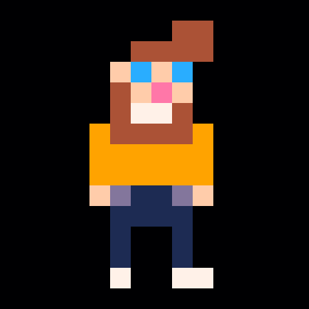

# 👋 

Hi, I'm Marc Duiker and I ❤ Serverless, DevCommunity, and Creative Coding! 😊

## 💪 - If you're part of an underrepresented group in the developer community, I'd like to help you with

- Being more involved with the local developer community in the Netherlands.
- Help with writing Call for Papers, give feedback on presentations.
- Getting started with serverless on Azure.

## 🏁 - Live projects

### 🎓 - Azure Functions University

Together with Gwyneth Peña-Siguenza I've started a series of lessons for people new to serverless and C#. Every other week we do a live coding session to go through [the lessons which are all open source](https://github.com/marcduiker/azure-functions-university).

### 🤖 - Azure Functions Updates Twitterbot

I've built the *Azure Functions Updates Twitterbot* ([Twitter](https://twitter.com/az_func_updates), [GitHub](https://github.com/marcduiker/az-func-updates)). It's been tweeting about new releases related to dozens of Azure Functions GitHub repositories since early 2019.

There are plans for extending this bot, see the [issues](https://github.com/marcduiker/az-func-updates/issues).

### 📝 - Azure Functions/Durable Functions Workshop

I've made a full day workshop for Azure Functions/Durable Functions called [*Building a resilient workflow using Durable Functions*](https://github.com/marcduiker/building-a-resilient-workflow-with-durable-functions). 

I've given this workshop several times, both as in-person classroom training as well as remote. Contact [Xpirit](https://www.xpirit.com/) or myself if you want me to do this workshop for your organization.

### 🕹 - Azure Functions, The Game

*Azure Functions, The Game*, is a retro game made with [PICO-8](https://www.lexaloffle.com/pico-8.php). It can be played online [here](https://marcduiker.itch.io/azure-functions-the-game). Sourcecode is in this [repo](https://github.com/marcduiker/pico-8-games).

## 👷 - Currently working on

- A Twitter bot for [meetupgemist.nl](https://meetupgemist.nl).
- A retro game called YuckyYAML.

## ✏|🎥 - My [B|V]log

- Durable Functions videos on [YouTube](https://www.youtube.com/channel/UCmoWqg6T-c8zEGm4sZdnwbA)
- Serverless & DevCommunity writings on [blog.marcduiker.nl](https://blog.marcduiker.nl/)

## 📞 - You can contact me to

- Give a presentation about **Azure Functions** / **Durable Functions** / **Creative Coding** for your conference/meetup.
- Do the *Building a resilient workflow using Durable Functions* workshop for your org.
- Talk about my dreamjob, to be an Azure ☁ 🥑.

## 🧔 - About

- Name: Marc Duiker
- Pronouns: he/him
- Company email: mduiker@xpirit.com
- Twitter: [@marcduiker](https://twitter.com/marcduiker)
- Presentations: [speakerdeck.com/marcduiker](https://speakerdeck.com/marcduiker)
- Sessionize: [sessionize.com/marcduiker](https://sessionize.com/marcduiker/)
- LinkedIn: [linkedin.com/in/mduiker](https://www.linkedin.com/in/mduiker/)
